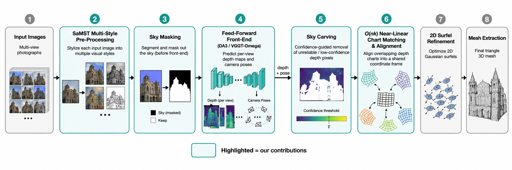
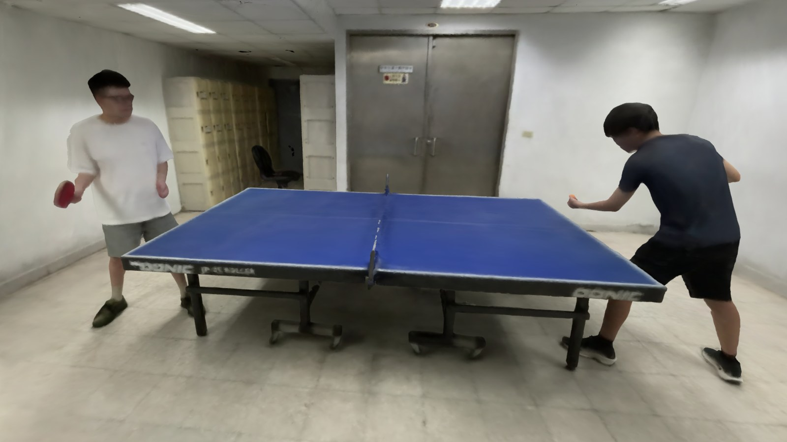
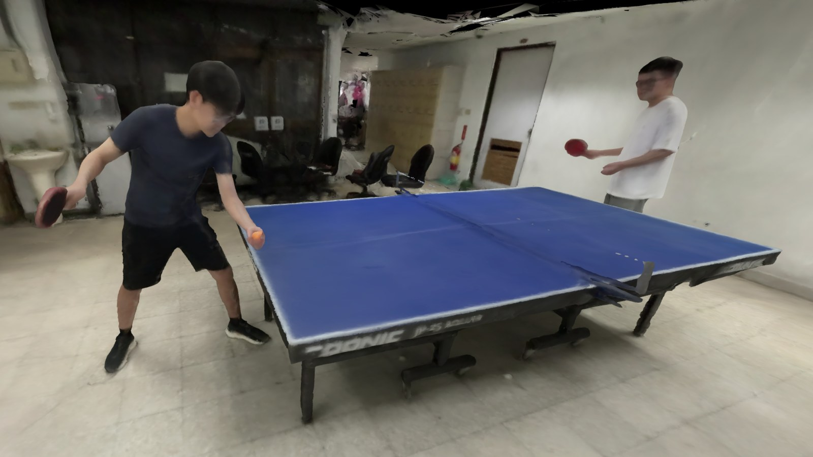
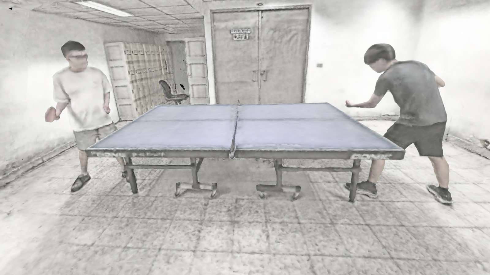
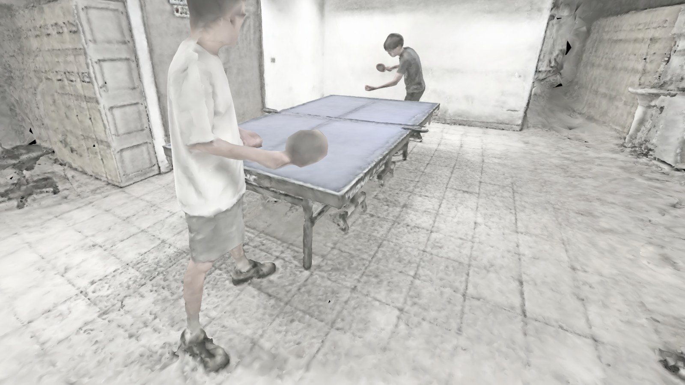
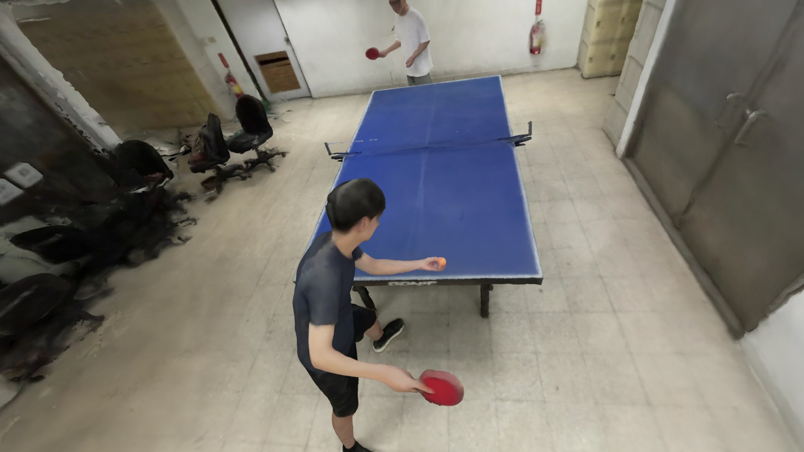
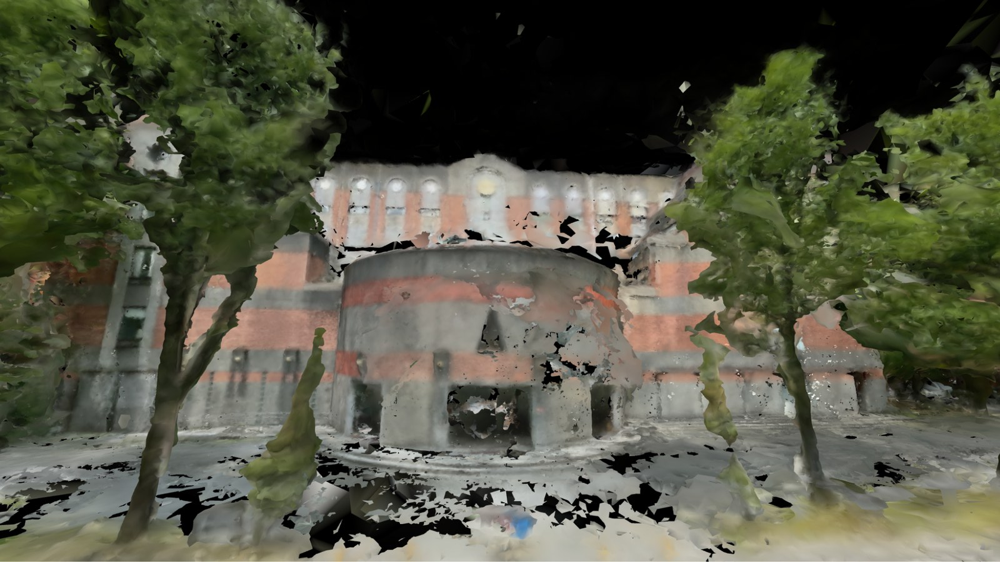

<div align="center">

# StyleGaussian 3D

### Generative Style Transfer and Monocular Depth Estimation for 2D Surfel-Based 3D Reconstruction

<font size="4">
Computer Graphics &mdash; Final Project
</font>
<br>

<font size="4">
Hsing-Yuan Wang &emsp;Bo-Yao Wang &emsp;Ting-Hao Chiu
</font>
<br><br>

<font size="4">
Built on top of <a href="https://anttwo.github.io/matcha/">MAtCha Gaussians</a> (CVPR 2025)
</font>

| <a href="https://anttwo.github.io/matcha/">MAtCha Webpage</a> | <a href="https://arxiv.org/abs/2412.06767">MAtCha arXiv</a> |



<b>StyleGaussian 3D extends MAtCha with a near-linear chart matcher, a feed-forward depth/pose front-end, sky handling, chunked large-scene reconstruction, an interactive viewer, and optional generative style transfer.</b>

</div>

---

## Overview

**StyleGaussian 3D** is an extension of [MAtCha Gaussians](https://github.com/Anttwo/MAtCha) for high-quality 3D surface reconstruction from sparse- or dense-view images using **2D Gaussian surfels** and an **Atlas of Charts**. We keep MAtCha's four-stage structure &mdash; *scene initialization → chart alignment → surfel refinement → mesh extraction* &mdash; but make the pipeline **more memory-efficient, more robust on unbounded outdoor scenes, scalable to arbitrarily long captures, and style-controllable**.

The original MAtCha pipeline has three practical bottlenecks that we address:

1. **Memory** &mdash; chart alignment matches *every* chart against every other one ($\mathcal{O}(n^2)$).
2. **Front-end cost & accuracy** &mdash; the two-stage `DepthAnythingV2 + MASt3R-SfM` front-end needs an explicit global depth alignment that is slow and fragile on ego-centric trajectories.
3. **Sky & floaters** &mdash; monocular depth hallucinates geometry for the sky and low-confidence regions, producing floating artifacts.

## What's new in StyleGaussian 3D

| # | Contribution | Idea | Where in the code |
|---|---|---|---|
| 1 | **Near-linear chart matching** | Replace all-pairs matching with a $k$-nearest-neighbor scheme: $\mathcal{O}(n^2)\!\rightarrow\!\mathcal{O}(nk)$, dramatically lowering peak VRAM | `matcha/dm_scene/matcher_3d.py`, `parallel_aligner.py` |
| 2 | **Feed-forward depth/pose front-end** | Swap `DepthAnythingV2 + MASt3R-SfM` for **Depth-Anything-3** / **VGGT-Omega**, which jointly predict depth and poses in one pass &mdash; no explicit alignment stage | `train.py --use_da3`, `scripts/da3_to_matcha.py`, `scripts/vggt_to_matcha.py` |
| 3 | **Sky masking + sky carving** | Learned sky segmentation **before** the front-end, and a confidence-guided ($\lambda=$ `conf_coef`) carving step **after** it, to remove hallucinated geometry | `scripts/mask_sky.py`, `--conf_coef` |
| 4 | **Chunked large-scene reconstruction** | One global front-end pass gives a shared camera frame; the capture is split into overlapping 25-frame chunks, reconstructed independently, then merged &amp; trimmed &mdash; peak VRAM is decoupled from sequence length | `run_large_scene.py` |
| 5 | **Interactive mesh viewer** | Browser-based Gradio/WebGL viewer that streams multi-million-face meshes with free-camera (WASD/QE) navigation | `scripts/interactive_viewer.py` |
| 6 | **Generative multi-style pre-processing** | Stylize the 2D input images with **SaMST** *before* reconstruction, so the recovered geometry stays multi-view consistent while the whole 3D scene adopts a target style | image-space pre-processing (see report §III-F) |

## Pipeline


Teal blocks are our contributions; gray blocks are inherited from MAtCha. See [report/main.pdf](report/main.pdf) for full details.

## Installation

StyleGaussian 3D uses the same environment as MAtCha (Conda + CUDA 11.8, PyTorch 2.0.1, PyTorch3D). See [old_README.md](old_README.md) for the detailed, step-by-step MAtCha installation if the quick install fails.

```shell
# 1) Clone
git clone https://github.com/Distant22/StyleGaussian3D
cd StyleGaussian3D

# 2) Create the conda env and build the CUDA extensions
python install.py            # creates the `matcha` env by default

# 3) Download the MAtCha pretrained weights (DepthAnythingV2, MASt3R-SfM)
python download_checkpoints.py
```

The new feed-forward front-ends and sky model require their own weights (excluded from git, see `.gitignore`):

- **Depth-Anything-3** &mdash; place weights under `Depth-Anything-3/da3_streaming/weights/` (`*.safetensors`).
- **VGGT-Omega** &mdash; place checkpoints under `vggt-omega/checkpoints/`.
- **Sky segmentation** &mdash; `scripts/skyseg.onnx` (used by `scripts/mask_sky.py`).

> **Heads-up:** model weights, reconstruction outputs (`image_output/`), prediction archives, and videos are intentionally **not** versioned. Re-download or regenerate them locally.

## Quick Start

Activate the environment first:

```shell
conda activate matcha
```

### 1. Reconstruct with the feed-forward front-end (recommended)

```shell
# (optional) mask the sky before the front-end on outdoor scenes
python scripts/mask_sky.py -i image_input/<scene> -o image_input/<scene>_masked

# DA3 front-end + confidence-guided sky carving (λ = 0.5)
python train.py -s image_input/<scene> -o image_output/<scene> \
    --use_da3 --conf_coef 0.5
```

- `--use_da3` &mdash; use the Depth-Anything-3 global poses/depth instead of MASt3R-SfM.
- `--da3_dir <PATH>` &mdash; reuse a pre-computed DA3 output directory.
- `--conf_coef <λ>` &mdash; sky-carving strength; `0.0` disables carving.

### 2. Original MAtCha baseline (for comparison)

```shell
python train.py -s image_input/<scene> -o image_output/<scene>_baseline \
    --sfm_config unposed --n_images 10
```

### 3. Large / building-scale scenes (chunked)

```shell
python run_large_scene.py -s image_input/<scene> -o image_output/<scene> \
    --chunk_size 25 --overlap 5 --conf_coef 0.5
# use VGGT-Omega for the global alignment instead of DA3:
python run_large_scene.py -s image_input/<scene> -o image_output/<scene> --use_vggt
```

A single global front-end pass produces a shared camera frame; chunks of `--chunk_size` frames (overlapping by `--overlap`) are reconstructed independently and merged, so peak VRAM depends on chunk size rather than the total number of images.

### 4. Inspect the result in the interactive viewer

```shell
python scripts/interactive_viewer.py --mesh_dir image_output/<scene> --port 7860
```

Open `http://localhost:7860`, jump to any training camera, and fly around with **WASD / QE**.

### 5. Stylized reconstruction (SaMST)

Stylization is an **image-space pre-processing** step: stylize every input view into a target style (e.g. *black&white*, *anime*, *Minecraft*, *stained glass*) with [SaMST](https://github.com/SYSU-SAIL/SaMST), then feed the stylized images to any of the commands above. Because every view is stylized consistently, the recovered geometry stays multi-view consistent while the whole 3D scene adopts the chosen style. See report §III-F.

## Results

<div align="center">


<br>
<b>Novel views of the <code>csie_pingpong</code> reconstruction (no stylization).</b><br><br>


<br>
<b>Same scene reconstructed from black&amp;white SaMST-stylized inputs &mdash; style and geometry stay decoupled.</b><br><br>


<br>
<b>Left: free-camera viewer. Right: chunked large-scene reconstruction of the CSIE building.</b>

</div>

## Repository structure

```
train.py                     # full pipeline (adds --use_da3 / --conf_coef)
run_large_scene.py           # chunked large-scene reconstruction
download_checkpoints.py      # fetch MAtCha pretrained weights
install.py                   # build conda env + CUDA extensions
matcha/                      # core MAtCha + near-linear matcher (our changes)
scripts/                     # mask_sky, interactive_viewer, da3/vggt converters, mesh stitching
assets/                      # figures used in this README
Depth-Anything-3/            # DA3 feed-forward front-end source (weights/outputs gitignored)
vggt-omega/                  # VGGT-Omega front-end source (weights/outputs gitignored)
Depth-Anything-V2/           # monocular depth (MAtCha baseline front-end)
mast3r/                      # MASt3R-SfM (MAtCha baseline front-end)
2d-gaussian-splatting/       # 2DGS rasterizer + adaptive tetrahedralization
vggt/                        # VGGT front-end — clone separately (not vendored)
report/                      # LaTeX report & figures (local only, gitignored)
image_input/                 # example input scenes (local only, gitignored)
```

## Acknowledgments

StyleGaussian 3D is a course project that builds directly on the excellent open-source work of others:

- [MAtCha Gaussians](https://github.com/Anttwo/MAtCha) (CVPR 2025) &mdash; the base pipeline this project extends
- [2D Gaussian Splatting](https://github.com/hbb1/2d-gaussian-splatting) and [Gaussian Opacity Fields](https://github.com/autonomousvision/gaussian-opacity-fields)
- [Depth-Anything-3](https://github.com/ByteDance-Seed/Depth-Anything-3), [Depth-Anything-V2](https://github.com/DepthAnything/Depth-Anything-V2), [VGGT](https://github.com/facebookresearch/vggt)
- [MASt3R-SfM](https://github.com/naver/mast3r/tree/mast3r_sfm)
- [SaMST](https://github.com/SYSU-SAIL/SaMST) for multi-style transfer

We thank the authors of all of the above for releasing their code and models.

## License

This project inherits the licenses of its components. Code in `mast3r/`, `Depth-Anything-V2/`, `Depth-Anything-3/`, `vggt/`, `vggt-omega/`, and `2d-gaussian-splatting/` is governed by the respective `LICENSE` files in those directories (some are **non-commercial**). The MAtCha-derived and original code follows the MIT [LICENSE](LICENSE). If you intend to use this project commercially, replace the non-commercial components with commercially licensed alternatives.

## Citation

This work extends MAtCha Gaussians. If you use it, please cite the original paper:

```bibtex
@article{guedon2025matcha,
  title={MAtCha Gaussians: Atlas of Charts for High-Quality Geometry and Photorealism From Sparse Views},
  author={Gu{\'e}don, Antoine and Ichikawa, Tomoki and Yamashita, Kohei and Nishino, Ko},
  journal={CVPR},
  year={2025}
}
```
